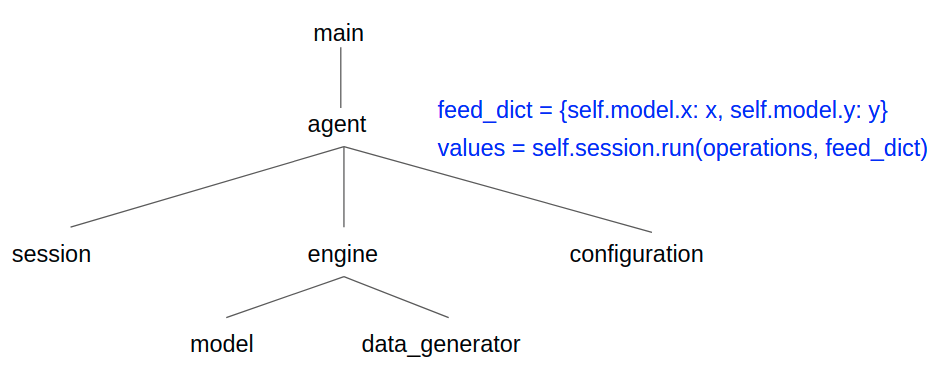
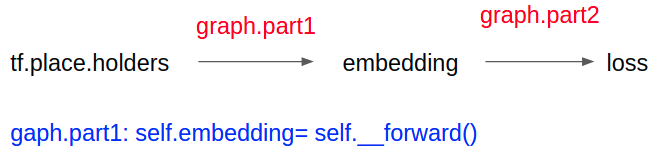
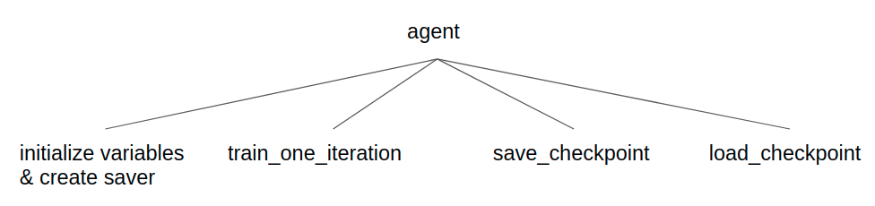

|Author|Xiaokang|
|---|---
|E-mail|kanwang@ucdavis.edu

Tensorflow project template
===========================
This repo is to show how to structure a deep learning project when coding in TF.
As this Chinese idiom, 纲举目张, says, the architecture of the project is a counterpart of the
the 纲 of a fishing net. When you have a brain-friendly architecture, 若罗网之有纪纲而万目张也.
### Architecture

The agent object connects model and data_generators by the blue code. The data_generator
fetches a batch of data according to the configuration file (batch size). The model defines
a computation graph which starts with tf.placeholders and ends with train_op, add_step_op and tensors (loss, output, accuracy).

##model

**1** When defining a computation graph, it is fine to define multiple modules and piece them together (see). The self.__init__ defines the inputs
and candidate output operations. For each output, there is a method.
**2**. The train_op is also defined in a method.

##agent

In MrGemy95's [implementation](https://github.com/MrGemy95/Tensorflow-Project-Template/blob/97adc2c3aa53c230425e3956379441a7704bf728/base/base_model.py), saving 
a model is also implemented in the Model class. Here you limit the responsibility of the Model class, only including the definition of the computation graph. Because no session is needed 
when defining the computation graph, whereas initializing variables, create a saver, saving/loading a checkpoint needs a session. So it is easier to grasp to encapsulate these four operations which are closely related to an session object in the Agent class.

sessiion is the 纲 when designing the Agent class.

The train_one_iteration method is wrapped to train multiple iterations.

## How to run?
change the MODEL_DIR in the config.yaml file then run: 
python main.py
It should print loss and accuracy.

